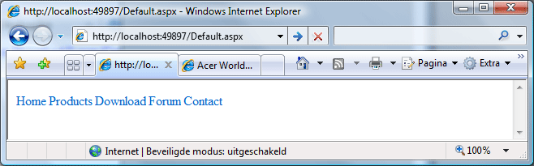
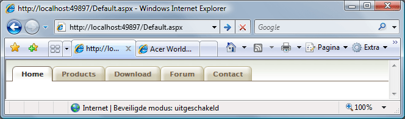
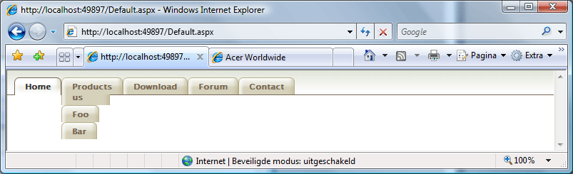
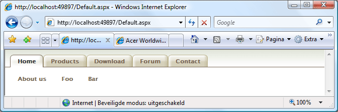
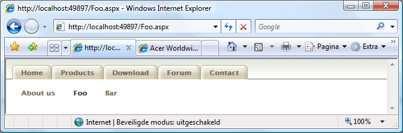
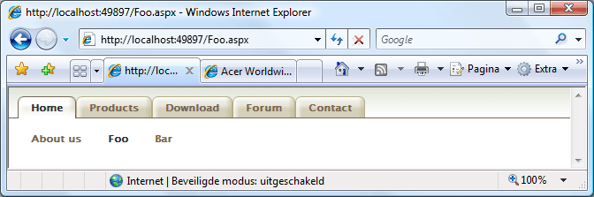

# ASP.NET Menu: Sliding Doors of CSS

## Introduction

The purpose of this article is to create a slick looking and easy to use menu for an ASP.NET enabled website. In order to accomplish this we'll use the standard functionality of the ASP.NET Menu web control and enhance the look purely by using Cascading Style Sheets (CSS).

For those of you familiar with CSS the title of this article will surely ring a bell. The CSS used to enhance the look and feel of the ASP.NET Menu control is decribed in a widely known article on [A List Apart](http://www.alistapart.com/), entitled "[Sliding Doors of CSS](http://www.alistapart.com/articles/slidingdoors/)".

The CSS used to improve the look and feel of the menu is thoroughly explained in the article on [A List Apart](http://www.alistapart.com/articles/slidingdoors/). Credit when credit is due. Thank Douglas Bowman for supplying us with the CSS. Be sure to read [his article](http://www.alistapart.com/articles/slidingdoors/) first if you are not familiar with it.

The focus of this article is on how to simulate such a menu in an ASP.NET environment. Let's get started...

## Sitemap

Let's fire up Visual Studio 2008 and create a new project using the ASP.NET Web Application project template. This template will automatically add a default web form appropriately named "Default.aspx". Open it in the editor and add the Menu control from the Toolbox which you can find under the Navigation tab. If you run the website now you'll wind up staring at a blank page. For the menu to display anything it first has to be bound to some data.

The easiest way to define data for the menu control to use and enable the visitors to navigate through the website is to bind it to a site map. Add a new site map item to the project using the proposed name of "Web.sitemap". The site map is an Xml file that organizes the pages of the site in a hierarchical manner. An added advantage is that it is automatically referenced by the SiteMapDataSource control.

Next add some pages to the sitemap as displayed in the listing below.

**Listing 1** - Web.sitemap

```xml
<?xml version="1.0" encoding="utf-8" ?>
<siteMap xmlns="http://schemas.microsoft.com/AspNet/SiteMap-File-1.0" >
    <siteMapNode url="" title=""  description="">
      <siteMapNode url="Default.aspx" title="Home"  description="Take me back to the dasboard" />
      <siteMapNode url="Products.aspx" title="Products"  description="Browse our catalog" />
      <siteMapNode url="Download.aspx" title="Download"  description="Download neat stuff" />
      <siteMapNode url="Forum.aspx" title="Forum"  description="Ask questions on our forum" />
      <siteMapNode url="Contact.aspx" title="Contact"  description="Contact us" />
    </siteMapNode>
</siteMap>
```

Now add a SiteMapDataSource control to the page and set the DataSourceID property of the menu control to the Id of the data source. Also set the Orientation property of the menu control to horizontal as it defaults to vertical. Last but not least set the ShowStartingNode property of the SiteMapDataSource to false. If you don't do this only the root node will be displayed and we don't want to include this base node in the menu. Your code should now resemble the code displayed in Listing 2.

**Listing 2** - Default.aspx

```html
<asp:Menu
  ID="Menu1"
  runat="server"
  DataSourceID="SitemapDataSource1"
  Orientation="Horizontal"
></asp:Menu>
<asp:SiteMapDataSource
  ID="SiteMapDataSource1"
  runat="server"
  ShowStartingNode="False"
/>
```

If you view the page in a browser now you should see a functional, yet boring menu.

**Figure 1** - Plain horizontal menu



## CSS Friendly Adapters

Before we can start applying CSS to the menu there is another issue that needs to be addressed first. If you take a look at the resulting HTML code that is generated when you request the default.aspx page you'll notice that the menu control does not generate the most flexible HTML code. By default it wraps each menu item in a table. This does not lend itself for easily applying CSS. It would be better if the Menu control generated an unordererd list which contains all the menu items.

Luckily the generated HTML can be adjusted by using control adapters. Control adapters allow you to render the HTML you prefer. Thankfully such control adapters are readily available on [CodePlex](http://www.codeplex.com). The [CSS Friendly Control Adapters kit](http://www.codeplex.com/cssfriendly) provides pre-built control adapters, including one for the ASP.NET Menu control.

To use the CSS Friendly Control Adapters follow these steps:

- Download the [latest release](http://www.codeplex.com/cssfriendly/Release/ProjectReleases.aspx?ReleaseId=2159). Download the version containing the source code and not the compiled assembly.
- Add the downloaded project to your solution.
- Download the [CSSFriendlyAdapters.browser](http://www.codeplex.com/cssfriendly/Release/ProjectReleases.aspx?ReleaseId=2159) file and add it to the App_Browsers folder of your ASP.NET Website project.

It is necessary to use the source code and compile the CSSFriendly.dll assembly ourselves because we need to tweak some of the CSS used by the adapters later on in this article.

When adding the CSSFriendly project to your solution the Visual Studio Conversion Wizard will popup. Just execute the conversion, everything should go smoothly. When the conversion has completed all that remains is to add a reference to the CSSFriendly project from the ASP.NET Website project.

Just run the website and take a look at the generated HTML code now.

**Listing 3** - CSS Friendly HTML code

```html
<div class="AspNet-Menu-Horizontal" id="Menu1">
  <ul class="AspNet-Menu">
    <li class="AspNet-Menu-Leaf  AspNet-Menu-Selected">
      <a
        href="/Default.aspx"
        class="AspNet-Menu-Link  AspNet-Menu-Selected"
        title="Take me back to the dasboard"
        >Home</a
      >
    </li>
    <li class="AspNet-Menu-Leaf">
      <a
        href="/Products.aspx"
        class="AspNet-Menu-Link"
        title="Browse our catalog"
        >Products</a
      >
    </li>
    <li class="AspNet-Menu-Leaf">
      <a
        href="/Download.aspx"
        class="AspNet-Menu-Link"
        title="Download neat stuff"
        >Download</a
      >
    </li>
    <li class="AspNet-Menu-Leaf">
      <a
        href="/Forum.aspx"
        class="AspNet-Menu-Link"
        title="Ask questions on our forum"
        >Forum</a
      >
    </li>
    <li class="AspNet-Menu-Leaf">
      <a href="/Contact.aspx" class="AspNet-Menu-Link" title="Contact us"
        >Contact</a
      >
    </li>
  </ul>
</div>
```

Things are looking up now.

**Remark**: The CSSFriendlyAdapters.browser file allows you to specify which CSS Friendly control adapters should be used. I make a habbit of commenting all of the adapters except the ones I want to use. This way no other controls are "adapted" and they'll keep generating the default HTML.

## Styling The Menu

As you can see from the code displayed in the listing above the adapter for the menu control automatically injects the necessary CSS classes for the `<ul>`, `<li>` and `<a>` tags. This saves us the trouble from having to define these.

It is also quite common for a single page to contain more than a single adapter control such as a menu. If you want a distinct look and feel for each control then set the CssSelectorClass for the adapted control. For instance, you might set the value of the CssSelectorClass property as follows:

**Listing 4** - CssSelectorClass property

```html
<asp:Menu
  ID="Menu1"
  runat="server"
  DataSourceID="SitemapDataSource1"
  Orientation="Horizontal"
  CssSelectorClass="PrettyMenu"
></asp:Menu>
```

The result is that the HTML code generated by the adapted control will be contained within a new layer (`<div>`).

**Listing 5** - Wrapping the generated HTML code

```html
<div class="PrettyMenu" id="Menu1">
  <!-- Other HTML code -->
</div>
```

Note that this property is specific to the CSS Friendly Adapters. It is a custom (expando) attribute which you can set for the controls supported by this library. It you require more information about the way the Friendly Adapters work, then please consult the following links:

- [ASP.NET 2.0 CSS Friendly Control Adapters: The Walkthrough](http://www.asp.net/CSSAdapters/WalkThru/WalkThrough.aspx)
- [ASP.NET 2.0 CSS Friendly Control Adapters: The White Paper](http://www.asp.net/CSSAdapters/WhitePaper.aspx)

With the CssSelectorClass generating a separate layer (`<div>`) around the menu and the automatically injected CSS classes in place we are finally ready to commence styling the menu.

The CSS used is simular to that of the [A List Apart article](http://www.alistapart.com/articles/slidingdoors/). As mentioned before the focus of this article isn't on the structure of the CSS but rather on how to apply it to the ASP.NET Menu control in order to obtain a neat looking tabular menu. The finished result can be seen in Figure 2.

**Figure 2** - The Finished result



On the [download page](http://cgeers.wordpress.com/download/) you can find the source code for this article. It contains the style sheet and the necessary images. Just perform the following steps to recreate the finished result:

- Add a Theme called "Default" under the ASP.NET folder Asp_Themes
- Add the existing images found in the compressed file containing the source code for this article under the newly create theme folder
- Add a style sheet called global.css to the Default theme
- Copy the contents of my global.css style sheet and paste them into your style sheet
- Open the web.config file and set the Theme property for the `<Pages>` node to Default. (See Listing 6)

**Listing 6** - Web.config excerpt

```xml
<system.web>
  <!-- ... -->
  <pages theme="Default">
    <!-- ... -->
  </pages>
  <!-- ... -->
</system.web>
```

The CSS used in my solution is simular to that of the article on A List Apart, but there are some changes. Mainly the changes correlate to the CSS structure applied by the CSS Friendly Adapters.

In order to apply the CSS the correct structure needs to used. When styling a control whose HTML is adjusted by a Friendly Adapter I find it handy to use diagrams mentioned in the white paper. These diagrams clearly show you how the CSS is structured.

You can find the diagram for the menu control [here](http://www.asp.net/CSSAdapters/images/Whitepaper/Css_Menu.gif).

## Sub Menu

One question I frequently came accross on a lot of forums is how to implement a horizontal sub menu which changes when the user selects a different tab from the top level menu. To create this we first need to adjust our site map.

Listing 7 shows the adjusted site map.

**Listing 7** - Web.sitemap with "sub menu items"

```xml
<?xml version="1.0" encoding="utf-8" ?>
<siteMap xmlns="http://schemas.microsoft.com/AspNet/SiteMap-File-1.0" >
    <siteMapNode url="" title=""  description="">
      <siteMapNode url="Default.aspx" title="Home"  description="Take me back to the dasboard">
        <siteMapNode url="About.aspx" title="About us" description="" />
        <siteMapNode url="Foo.aspx" title="Foo" description="" />
        <siteMapNode url="Bar.aspx" title="Bar" description="" />
      </siteMapNode>
      <!-- ... -->
</siteMap>
```

For brevity's sake Listing 7 only displays the sub menu items (nodes) for the Home node. Check out the Web.sitemap in the source code for the complete version. Now when you browse the website using this site map you'll see the effect shown in Figure 3.

**Figure 3** - Sub menu items



To disable this effect set the MaximumDynamicDisplayLevels property of the menu control to zero as shown in Listing 8.

**Listing 8** - MaximumDynamicDisplayLevels property

```html
<asp:Menu
  ID="Menu1"
  runat="server"
  DataSourceID="SitemapDataSource1"
  Orientation="Horizontal"
  CssSelectorClass="PrettyMenu"
  MaximumDynamicDisplayLevels="0"
></asp:Menu>
```

Next add a second Menu and SiteMapDataSource control and set their properties as shown in Listing 9.

**Listing 9** - Sub menu control

```html
<asp:Menu
  ID="Menu1"
  runat="server"
  DataSourceID="SitemapDataSource1"
  Orientation="Horizontal"
  CssSelectorClass="PrettyMenu"
  MaximumDynamicDisplayLevels="0"
>
</asp:Menu>
<asp:Menu
  ID="Menu2"
  runat="server"
  DataSourceID="SitemapDataSource2"
  Orientation="Horizontal"
  CssSelectorClass="PrettySubMenu"
>
</asp:Menu>
<asp:SiteMapDataSource
  ID="SiteMapDataSource1"
  runat="server"
  ShowStartingNode="False"
/>
<asp:SiteMapDataSource
  ID="SiteMapDataSource2"
  runat="server"
  StartingNodeOffset="1"
  ShowStartingNode="False"
/>
```

We basically tell the second menu that it should display the second level of nodes found in the site map and that it should not display the starting node which corresponds to the selected tab of the first menu.

Also the CssSelectorClass for the second menu is set to PrettySubMenu. The CSS for this menu is simular to the first menu. Download the source code if you want to check it out. Running the website now will give you this spiffy result.

**Figure 4** - Styled sub menu items



## Finishing Up

One last issue needs to be resolved. In order to illustrate this issue the project needs to be reorganized.

First let's add a master page to the project called Site.master. Move the code, the menus and data sources, from the Default.aspx page to the master page and place it just before the first content place holder in the body. Afterwards you can safely delete the Default.aspx page.

Now let's add a few Web Content Form items to the project. Add Web Content Forms that correspond to the items of the first node of the site map and its sub nodes, namely:

- Default.aspx
- About.aspx
- Foo.aspx
- Bar.aspx

Be sure to choose Site.master as the master page for each of these web content forms. The other pages mentioned in the Web.sitemap are purely there for illustrative purposes.

Launch the site again, and navigate to the Foo page. This will reveal the issue.

**Figure 5** - Selection issue



Because we have navigated to the bottom level in the site map the top level menu does not know which menu item it should mark as selected. We will need do some coding in the master page's code behind in order to solve this.

Listing 10 shows you the necessary morsel of code.

**Listing 10** - Selecting the correct top level menu item

```csharp
namespace MenuWebApplication
{
    public partial class Site : System.Web.UI.MasterPage
    {
        private static string ExtractBaseUrl(string url)
        {
            return url.Contains("?") ? url.Remove(url.IndexOf('?')) : url;
        }

        protected void Page_Load(object sender, EventArgs e)
        {
            Menu1.DataBind();

            // Which node in the site map is currently selected?
            SiteMapNode currentNode = SiteMap.CurrentNode;
            if (currentNode != null)
            {
                // Obtain the Url of the currently selected node's parent node.
                string parentUrl = String.Empty;
                SiteMapNode parentNode = currentNode.ParentNode;
                if (parentNode != null)
                {
                    parentUrl = ExtractBaseUrl(parentNode.Url);
                }

                // Obtain the Url of the currently selected node.
                string currentUrl = ExtractBaseUrl(currentNode.Url);

                // Iterate the top level menu tier.
                foreach (MenuItem menuItem in Menu1.Items)
                {
                    // Compare the menu item's Url against the currently
                    // selected node's Url or the Url of its parent.
                    string menuItemUrl = ExtractBaseUrl(menuItem.NavigateUrl);
                    if ((currentUrl == menuItemUrl) || (parentUrl == menuItemUrl))
                    {
                        // If either matches then mark the top level menu item as selected.
                        Menu1.Items[Menu1.Items.IndexOf(menuItem)].Selected = true;
                        break;
                    }
                }
            }
        }
    }
}
```

Now you are free to select any of the sub menu items. It's corresponding top level menu item will stay selected to give the visitor a visual clue as to where he currently is located within the website.

**Figure 6** - Selection issue fixed



## Summary

It's quite a bit of work to establish a fancy tabular menu with a context sensitive horizontal sub menu but in the end you wind up with a slick looking and user friendly menu.

I suggest that you implement such a menu in a user control and include that user control on your web site's master page. In most cases one such menu will be used throughout the entire website.
